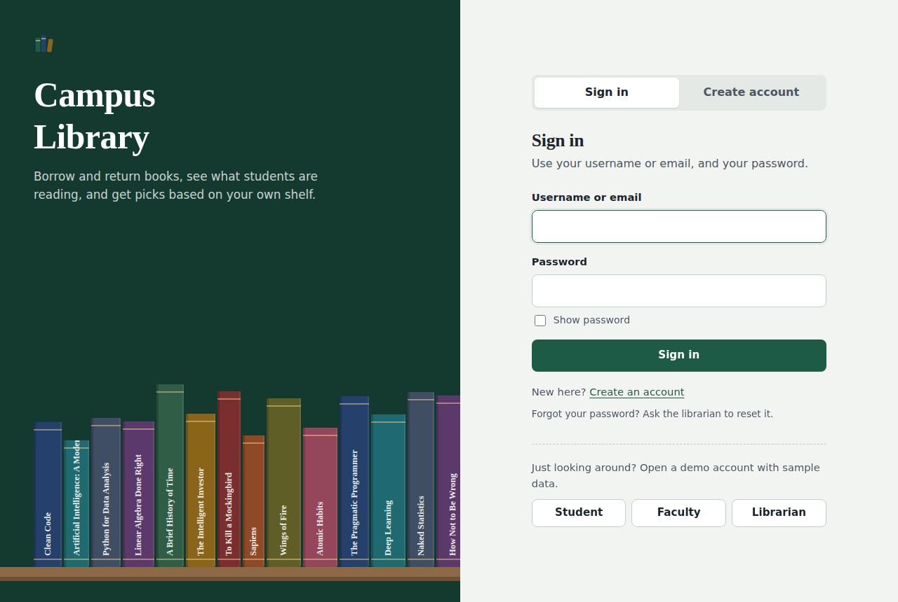
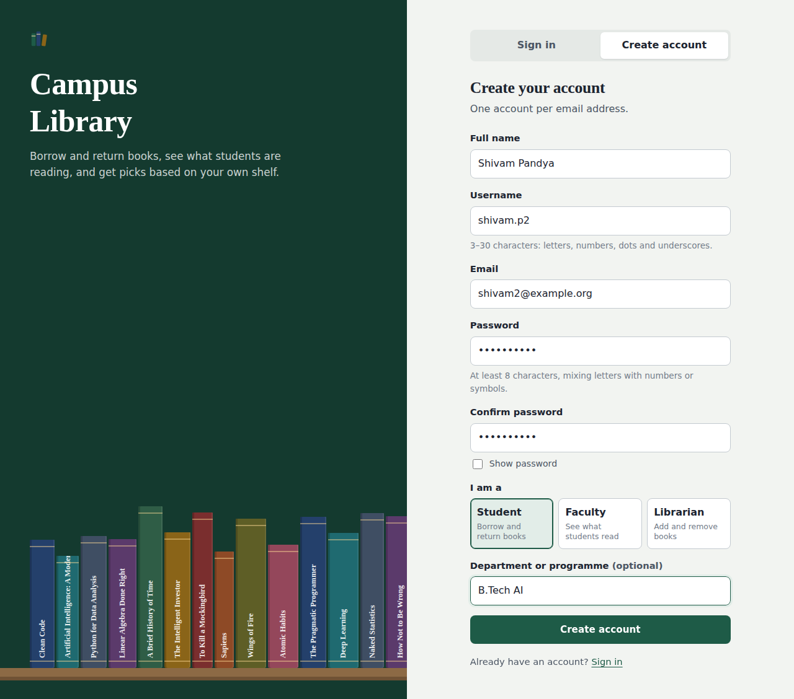
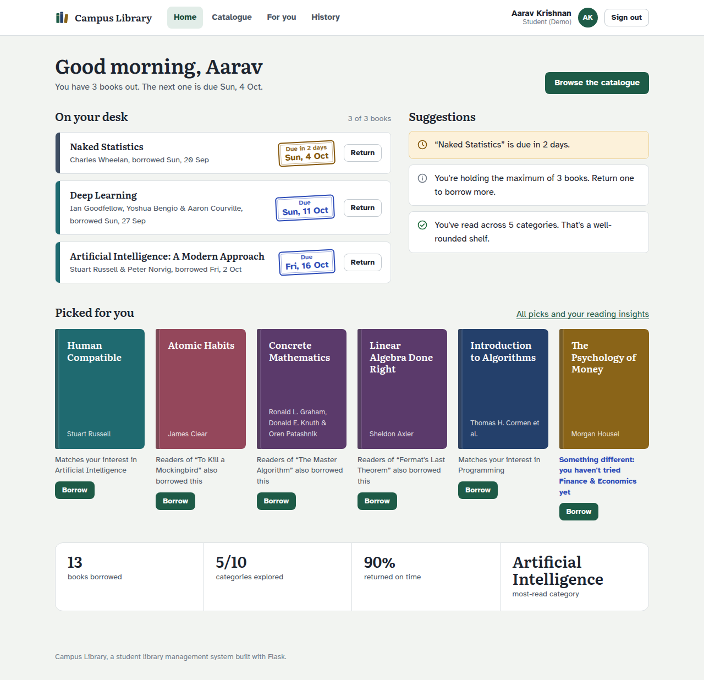
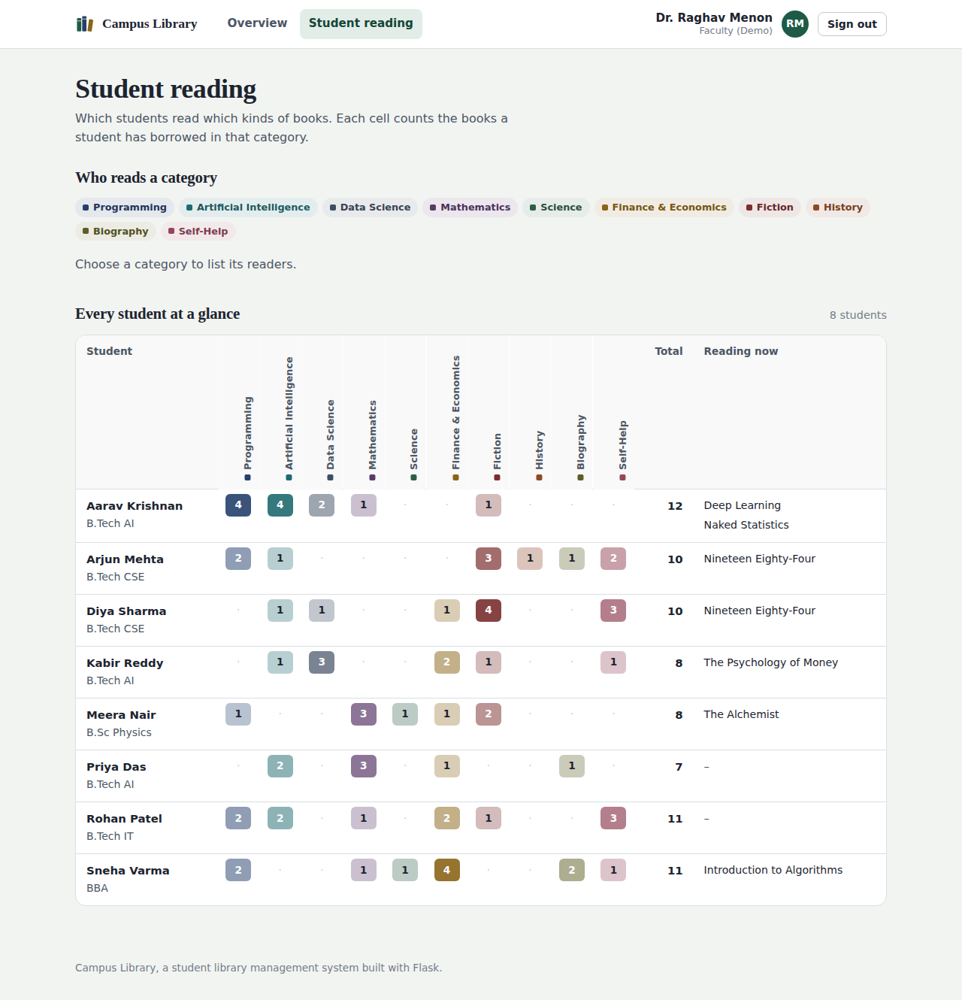
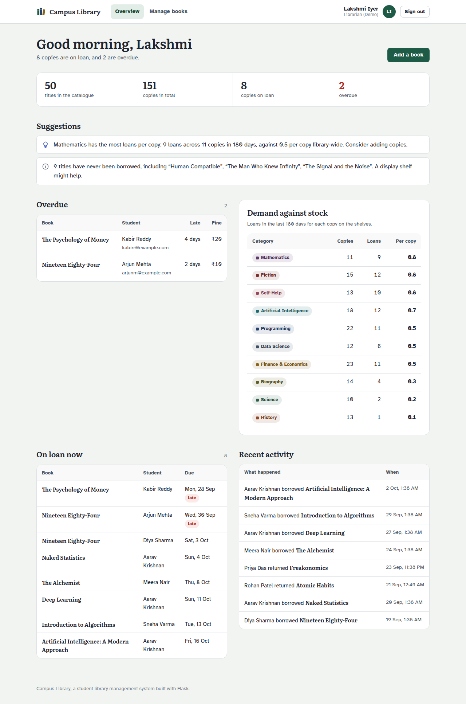

# Student Library Management System

A web app for a college library, built with **Python and Flask**. Students, faculty and librarians create an account with their **username, email and password** (one account per email), and each role gets its own dashboard. The app also **recommends books** from each student's borrowing history and shows **simple reading insights**.



## What each role can do

| Role | What they get |
|---|---|
| **Student** | Browse and search the catalogue, **issue (borrow)** and **return** books, see due dates and fines, get **personal recommendations**, reading insights and suggestions, and a full borrowing history. |
| **Faculty** | See **which students are reading which types of books**: a student × category grid, a "who reads this category" filter, each student's reading profile, most borrowed books and most active readers. |
| **Librarian** | **Add new books**, **delete books**, change the number of copies, see overdue loans with fines, everything on loan, recent activity, and stock suggestions (which categories need more copies, which titles are never borrowed). |

### Accounts and sign-in

- **Sign up** with full name, username, email, password and role. Each email can only have **one account**, and each username is unique.
- **Sign in** with your **username or email** plus your password.
- Passwords need at least 8 characters with a mix of letters and numbers or symbols. They are stored **hashed** (PBKDF2-SHA256), never as plain text.
- After 5 wrong passwords, the account is paused for 15 minutes to stop guessing.
- Faculty and librarian sign-ups need a **staff access code**, so students can't make themselves librarians.
- All forms are protected against CSRF.

| Create an account | Student home |
|---|---|
|  |  |

| Faculty: who reads what | Librarian overview |
|---|---|
|  |  |

More screenshots are in [`docs/screenshots`](docs/screenshots).

## How the recommendations work

For each book the student hasn't read, the app adds up four simple signals (see [`library/recommender.py`](library/recommender.py)):

- **Category match**: how much of the student's reading is in that category. Recent books count more (a 90-day half-life).
- **Same author**: the student has read this author before.
- **Also borrowed**: students who borrowed the same books also borrowed this one (cosine similarity, and only links backed by at least two students).
- **Popularity**: how often it was borrowed in the last 180 days.

Each card explains *why* it was picked ("Matches your interest in Artificial Intelligence", "Readers of “Clean Code” also borrowed this"). At most two picks share a category, and one pick always comes from a category the student hasn't tried yet. New students get the most popular books.

**Insights** (see [`library/insights.py`](library/insights.py)): books borrowed, categories explored, on-time return rate, average days kept, reading by category, books per month, plus suggestions such as due-soon and overdue warnings with fines, "most of your reading is X, try Y", and late-return reminders.

## Library rules (configurable)

- Up to **3 books** at a time, for **14 days** each.
- A student with an overdue book can't borrow another until it's returned.
- Late returns are fined **₹5 per day**.
- A book can't be deleted while copies are on loan. Deleted books are hidden, not erased, so history and insights stay correct.

## Run it on your computer

You need Python 3.10 or newer.

```bash
git clone https://github.com/shivam-pandyacoder24/Student-library-management-system.git
cd Student-library-management-system
pip install -r requirements.txt
python wsgi.py
```

On Windows, use `py` instead of `python` if `python` isn't recognised.

Open http://127.0.0.1:5000 **while that window stays open** (closing it stops the site). The database (`instance/library.db`) is created automatically with 50 books and demo accounts. Use the **Student / Faculty / Librarian** demo buttons on the sign-in page to look around, or create your own account.

Run the tests (33 of them, covering accounts, passwords, roles, loans and recommendations):

```bash
python -m unittest discover -s tests -v
```

## Put it online (free)

### Option 1: PythonAnywhere (recommended: your data is kept)

1. Create a free **Beginner** account at [pythonanywhere.com](https://www.pythonanywhere.com/). Your site will be `https://YOUR-USERNAME.pythonanywhere.com`.
2. Open **Consoles → Bash** and run, one line at a time:
   ```bash
   git clone https://github.com/shivam-pandyacoder24/Student-library-management-system.git
   cd Student-library-management-system
   python3.11 -m venv ~/venv-library
   source ~/venv-library/bin/activate
   pip install -r requirements.txt
   python3 -c "import secrets; print(secrets.token_hex(32))"
   ```
3. Copy the long text the last command printed. Then create your settings file (replace the two values first):
   ```bash
   cat > .env <<'EOF'
   SECRET_KEY=paste-the-long-text-here
   STAFF_ACCESS_CODE=choose-a-code-for-faculty-and-librarians
   COOKIE_SECURE=1
   EOF
   ```
4. Go to **Web → Add a new web app → Next → Manual configuration → Python 3.11 → Next**.
5. Under **Virtualenv**, enter `/home/YOUR-USERNAME/venv-library`.
6. Click the **WSGI configuration file** link, delete everything in it, paste this (with your username), and **Save**:
   ```python
   import os, sys
   path = "/home/YOUR-USERNAME/Student-library-management-system"
   if path not in sys.path:
       sys.path.insert(0, path)
   os.chdir(path)
   from wsgi import app as application
   ```
7. Back on the **Web** tab, turn on **Force HTTPS** and click **Reload**. Your site is live.

**Keep it running:** free sites switch off after a month unless extended, so log in about once a month and click **"Run until 1 month from today"** on the Web tab.

**Update after changes on GitHub:** in a Bash console run `cd Student-library-management-system && git pull`, then click **Reload**.

**If you see "Something went wrong":** open the **Error log** link on the Web tab. The usual causes are a wrong username in the WSGI file, a missing virtualenv path, or forgetting to click Reload.

### Option 2: Render (one click)

[](https://render.com/deploy?repo=https://github.com/shivam-pandyacoder24/Student-library-management-system)

Render reads [`render.yaml`](render.yaml) and generates `SECRET_KEY` and `STAFF_ACCESS_CODE` for you (find the code under the service's **Environment** tab). Note that Render's free plan doesn't keep files between restarts, so accounts and loans reset whenever the service restarts (the demo data reloads automatically). Use PythonAnywhere if you need data to stay.

## Forgot password

The librarian (or whoever runs the server) can set a new password from a console in the project folder:

```bash
flask --app wsgi set-password USERNAME-OR-EMAIL
```

It asks for the new password twice. On PythonAnywhere, run `source ~/venv-library/bin/activate` first.

## Settings

All settings are environment variables (or lines in `.env`). See [`.env.example`](.env.example).

| Variable | What it does | Default |
|---|---|---|
| `SECRET_KEY` | Signs session cookies. **Set a long random value.** | dev value |
| `STAFF_ACCESS_CODE` | Code needed to sign up as faculty or librarian | `staff123` |
| `LIBRARY_NAME` | Name shown in the header | Campus Library |
| `SEED_DEMO_DATA` | Load 50 books, 10 demo accounts and history into an empty database | `1` |
| `ENABLE_DEMO_LOGIN` | Show the one-click demo buttons. **Set to `0` for real use**, since anyone could open the librarian demo. | `1` |
| `LOAN_DAYS`, `MAX_ACTIVE_LOANS`, `FINE_PER_DAY` | Library rules | `14`, `3`, `5` |
| `DATABASE_PATH` | Where the SQLite file lives | `instance/library.db` |
| `COOKIE_SECURE` | Send cookies only over HTTPS | `0` |

Reload the demo data at any time with `flask --app wsgi reset-demo` (this wipes the database).

## Project structure

```
├── wsgi.py                  entry point (gunicorn, PythonAnywhere, python wsgi.py)
├── library/
│   ├── __init__.py          app factory, template filters, error pages, CLI commands
│   ├── config.py            settings from environment variables
│   ├── db.py                SQLite schema and helpers (built-in sqlite3, no ORM)
│   ├── auth.py              sign up, sign in, password checks, demo logins
│   ├── services.py          issue/return rules, availability, fines
│   ├── recommender.py       book recommendations
│   ├── insights.py          student, faculty and librarian insights
│   ├── student.py           student pages
│   ├── faculty.py           faculty pages
│   ├── librarian.py         librarian pages
│   ├── seed.py              demo catalogue, accounts and borrowing history
│   ├── catalog.py           categories and their colours
│   ├── templates/           Jinja2 HTML templates
│   └── static/              CSS and icon
├── tests/test_app.py        automated tests
├── render.yaml              Render deployment
└── .env.example             settings template
```

**Database tables:** `users` (username, email, name, role, password hash), `books` (title, author, category, copies), `loans` (who borrowed what, when it's due, when it came back), `login_failures` (recent wrong-password attempts, for the 15-minute pause).

## Tech stack

Python 3, Flask, Jinja2, SQLite, Werkzeug password hashing, plain HTML and CSS (no JavaScript framework), gunicorn for Render.
