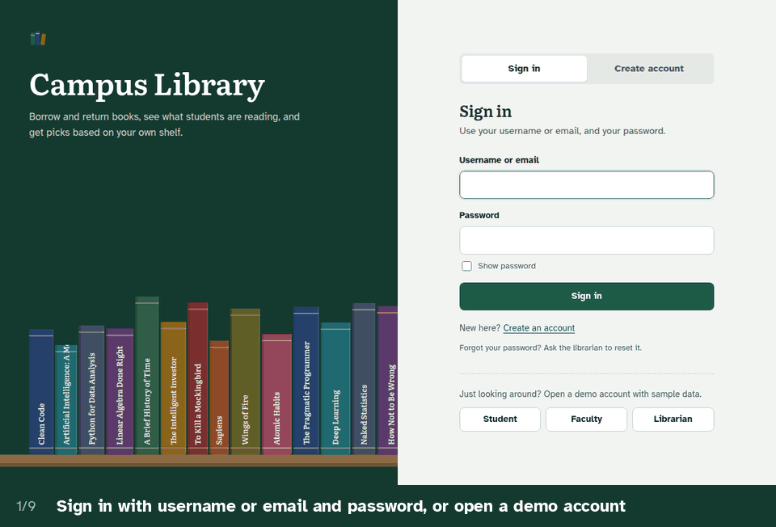
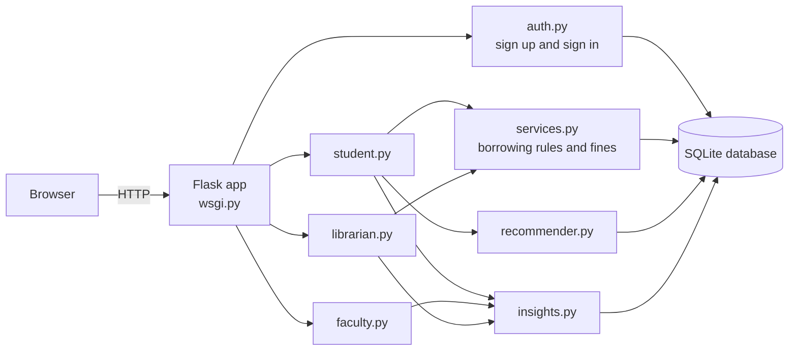
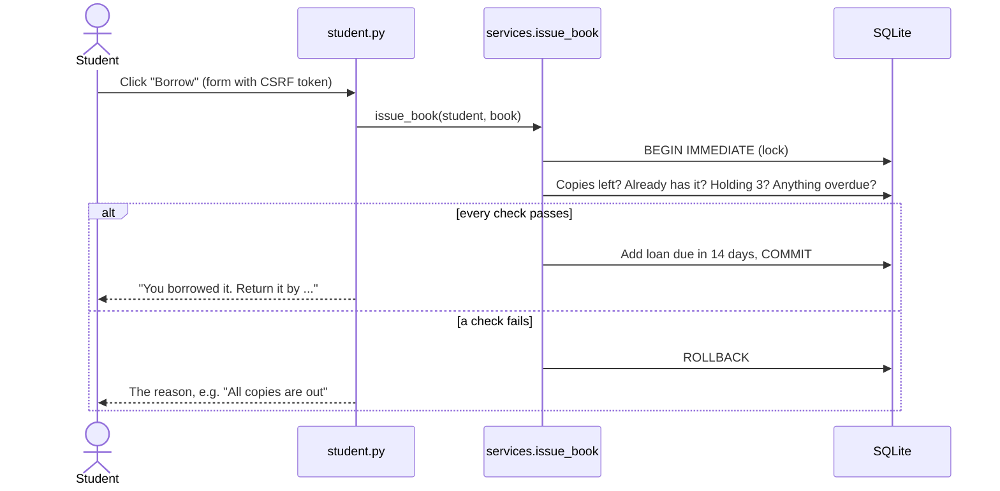
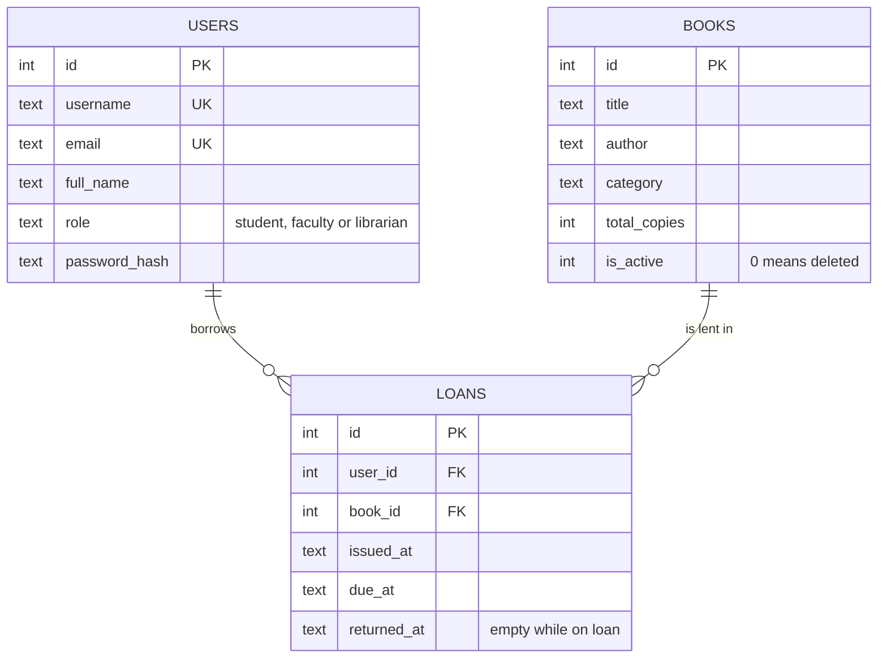
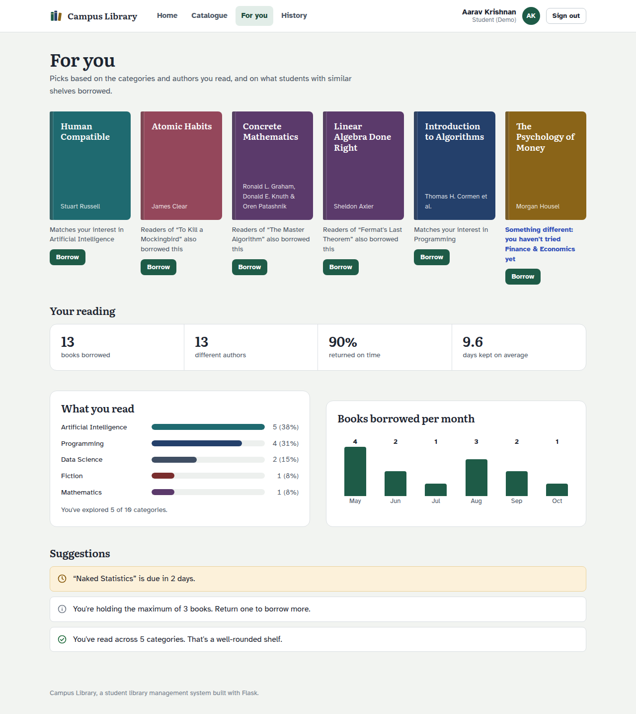
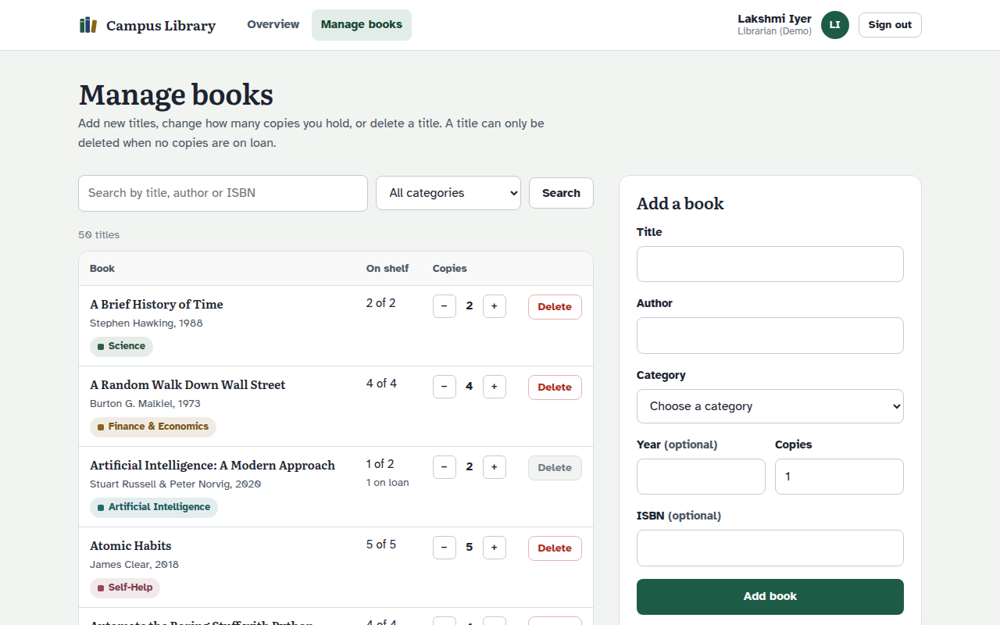
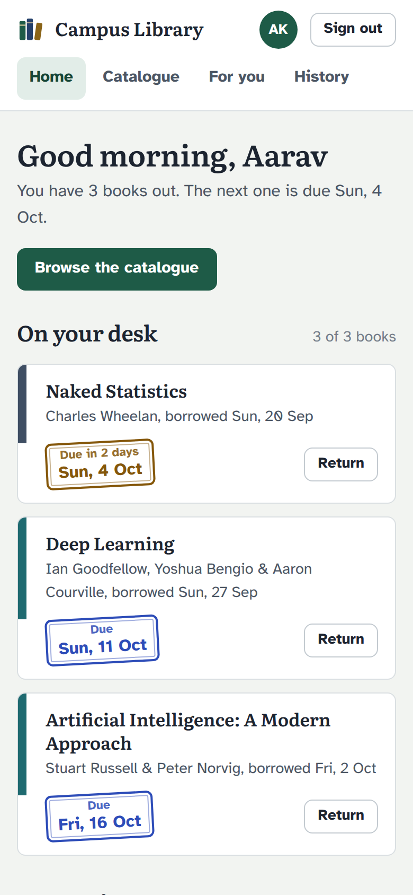

# Student Library Management System

A full-stack web app for a college library. **Students** borrow and return books and get personalised recommendations, **faculty** see what students are reading, and **librarians** manage the catalogue.

[](https://student-library-e9dr.onrender.com)
[](https://github.com/shivam-pandyacoder24/Student-library-management-system/actions/workflows/tests.yml)


[](LICENSE)

**Live demo: https://student-library-e9dr.onrender.com**

> **Try it in 10 seconds:** open the live demo and click **Student**, **Faculty** or **Librarian** under "Just looking around?". No sign-up needed.
> It runs on free hosting, so the first visit after a quiet spell takes about a minute to wake up, and demo data resets when the server restarts.



## Contents

- [Features](#features)
- [Engineering highlights](#engineering-highlights)
- [How it works](#how-it-works)
- [Screenshots](#screenshots)
- [Run it on your computer](#run-it-on-your-computer)
- [Deploy it](#deploy-it)
- [What I'd build next](#what-id-build-next)

## Features

**Students**
- Search the catalogue by title, author, ISBN or category, and see how many copies are on the shelf
- Borrow (issue) and return books, with due dates and late fines
- Get **book recommendations**, each with the reason it was picked
- See **reading insights**: categories read, books per month, on-time return rate
- Get **suggestions**: due-soon and overdue alerts, and nudges to try new categories

**Faculty**
- A **student × category grid** showing which students read which kinds of books
- A category filter that lists every student reading, say, Artificial Intelligence
- Each student's reading profile and history, plus the most borrowed books and most active readers

**Librarians**
- **Add books**, **delete books**, and change the number of copies
- See overdue loans with fines, everything on loan, and recent activity
- **Stock suggestions**: which categories need more copies, which titles are never borrowed

**Accounts**
- Sign up with name, username, email, password and role. **One account per email.**
- Sign in with username or email, plus password
- Faculty and librarian sign-ups need a staff access code, so students can't make themselves librarians

## Engineering highlights

- **Recommendation engine** built from scratch: content-based scoring (category and author) combined with collaborative filtering ("students who read X also borrowed Y", using cosine similarity), recency weighting and a diversity rule. [How it scores books](#how-recommendations-are-picked).
- **No double-booking:** borrowing runs inside a locked database transaction (`BEGIN IMMEDIATE`), so two students can't take the last copy at the same moment.
- **Security:**
  - Passwords are hashed with PBKDF2-SHA256.
  - Every form carries a CSRF token.
  - Accounts pause for 15 minutes after 5 wrong passwords.
  - Each page checks the user's role.
  - The session is renewed at sign-in.
  - Redirects only go to pages on this site.
- **Data that can't drift:** available copies are calculated from open loans, not stored as a counter. Deleted books are hidden rather than erased, so history and insights stay correct.
- **Plain SQL** with Python's built-in `sqlite3` (no ORM), including joins, grouping and a self-join for "also borrowed".
- **33 automated tests** covering accounts, passwords, roles, borrowing rules and recommendations. They run on every push with GitHub Actions.
- **No JavaScript framework:** server-rendered pages with hand-written, responsive CSS that works on phones.

## How it works

### Architecture



Each role has its own set of pages (a Flask *blueprint*). The pages call three small modules for the logic: `services.py` (borrowing rules), `recommender.py` and `insights.py`. All data lives in one SQLite file.

### What happens when a student borrows a book



### Database



A fourth table, `login_failures`, records recent wrong-password attempts for the 15-minute pause.

### How recommendations are picked

For every book a student hasn't read, the app adds up four signals:

```
score = 0.60 × category match     how much of their reading is in this category (recent books count more)
      + 0.25 × same author        they've read this author before
      + 0.35 × also borrowed      students who read the same books also borrowed this one
      + 0.10 × popularity         borrowed often in the last 180 days
```

The top books become the picks. Three extra rules keep the list useful:

- At most two picks come from the same category.
- One pick is always from a category the student hasn't tried yet ("Something different").
- A brand-new student gets the most popular books.

Each card shows the strongest reason, for example *"Readers of “Clean Code” also borrowed this"*.

### Where to find things in the code

| To understand… | Look at |
|---|---|
| Sign-up, sign-in and the wrong-password pause | [`library/auth.py`](library/auth.py) |
| Borrowing rules, due dates and fines | [`library/services.py`](library/services.py) |
| How recommendations are scored | [`library/recommender.py`](library/recommender.py) |
| Insights and suggestions | [`library/insights.py`](library/insights.py) |
| The pages for each role | [`student.py`](library/student.py), [`faculty.py`](library/faculty.py), [`librarian.py`](library/librarian.py) and [`templates/`](library/templates) |
| Database tables | [`library/db.py`](library/db.py) |
| Settings | [`library/config.py`](library/config.py) |
| Demo books, accounts and history | [`library/seed.py`](library/seed.py) |
| Tests | [`tests/test_app.py`](tests/test_app.py) |

## Screenshots

| Sign in | Create an account |
|---|---|
|  |  |

| Student home | Recommendations and insights |
|---|---|
|  |  |

| Faculty: who reads what | Librarian overview |
|---|---|
|  |  |

| Librarian: manage books | On a phone |
|---|---|
|  |  |

## Run it on your computer

You need Python 3.10 or newer.

```bash
git clone https://github.com/shivam-pandyacoder24/Student-library-management-system.git
cd Student-library-management-system
pip install -r requirements.txt
python wsgi.py
```

Open http://127.0.0.1:5000 and keep that terminal open while you use it. On Windows, type `py` instead of `python` if `python` isn't recognised.

The database is created automatically with 50 books, demo accounts and borrowing history.

Run the tests:

```bash
python -m unittest discover -s tests -v
```

## Deploy it

| Option | Best for | Keeps new accounts? |
|---|---|---|
| **Render** (one click, sign in with GitHub) | A permanent public link | No, data resets on restart |
| **PythonAnywhere** | A real library that keeps its data | Yes |
| **Cloudflare tunnel** from your laptop | A quick live demo, no account | While your laptop is on |

[](https://render.com/deploy?repo=https://github.com/shivam-pandyacoder24/Student-library-management-system)

Step-by-step instructions for all three, plus settings and resetting passwords, are in **[docs/DEPLOYMENT.md](docs/DEPLOYMENT.md)**.

## What I'd build next

- Email reminders two days before a book is due
- A waiting list when all copies of a book are out
- Book cover images from the Open Library API
- PostgreSQL, so data persists on any host
- CSV import for adding many books at once
- A small JSON API for a mobile app

## Built with

Python, Flask, Jinja2, SQLite, Werkzeug (password hashing), HTML and CSS, GitHub Actions, Render.

This project was built with the help of [Claude](https://claude.ai), Anthropic's AI assistant, used as a pair programmer. Commits it co-wrote are marked in the history.

## Author

[@shivam-pandyacoder24](https://github.com/shivam-pandyacoder24)

## License

[MIT](LICENSE)
