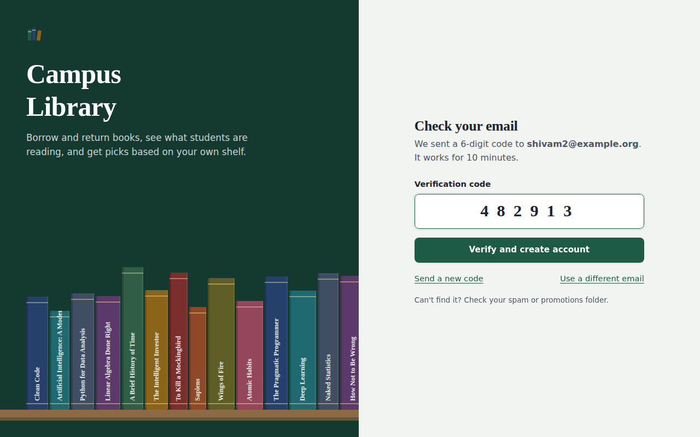

# Student Library Management System

A web app for a college library, built with **Python and Flask**. Students, faculty and librarians sign in with their **username and email**, confirm it with a **6-digit code sent to their inbox (OTP)**, and each role gets its own dashboard. The app also **recommends books** from each student's borrowing history and shows **simple reading insights**.


## What each role can do

| Role | What they get |
|---|---|
| **Student** | Browse and search the catalogue, **issue (borrow)** and **return** books, see due dates and fines, get **personal recommendations**, reading insights and suggestions, and a full borrowing history. |
| **Faculty** | See **which students are reading which types of books**: a student × category grid, a "who reads this category" filter, each student's reading profile, most borrowed books and most active readers. |
| **Librarian** | **Add new books**, **delete books**, change the number of copies, see overdue loans with fines, everything on loan, recent activity, and stock suggestions (which categories need more copies, which titles are never borrowed). |

### Sign up and sign in with an email code

1. Sign up with full name, username, email and role (faculty and librarian sign-ups also need a **staff access code**, so students can't make themselves librarians).
2. The app emails a 6-digit code. The account is only created after the code is entered.
3. Next time, sign in with **username + email** and a fresh code.

Codes expire after 10 minutes, allow 5 attempts, are stored hashed, and are rate-limited (one every 45 seconds, 6 per hour per email). All forms are protected against CSRF.

| Verify your email | Student home |
|---|---|
|  |  |

| Faculty: who reads what | Librarian overview |
|---|---|
|  |  |

More screenshots are in [`docs/screenshots`](docs/screenshots).

## How the recommendations work

For each book the student hasn't read, the app adds up four simple signals (see [`library/recommender.py`](library/recommender.py)):

- **Category match**: how much of the student's reading is in that category. Recent books count more (a 90-day half-life).
- **Same author**: the student has read this author before.
- **Also borrowed**: students who borrowed the same books also borrowed this one (cosine similarity, and only links backed by at least two students).
- **Popularity**: how often it was borrowed in the last 180 days.

Each card explains *why* it was picked ("Matches your interest in Artificial Intelligence", "Readers of “Clean Code” also borrowed this"). At most two picks share a category, and one pick always comes from a category the student hasn't tried yet. New students get the most popular books.

**Insights** (see [`library/insights.py`](library/insights.py)): books borrowed, categories explored, on-time return rate, average days kept, reading by category, books per month, plus suggestions such as due-soon and overdue warnings with fines, "most of your reading is X, try Y", and late-return reminders.

## Library rules (configurable)

- Up to **3 books** at a time, for **14 days** each.
- A student with an overdue book can't borrow another until it's returned.
- Late returns are fined **₹5 per day**.
- A book can't be deleted while copies are on loan. Deleted books are hidden, not erased, so history and insights stay correct.

## Run it on your computer

You need Python 3.10 or newer.

```bash
git clone https://github.com/shivam-pandyacoder24/Student-library-management-system.git
cd Student-library-management-system
python -m venv .venv
# Windows:   .venv\Scripts\activate
# Mac/Linux: source .venv/bin/activate
pip install -r requirements.txt
python wsgi.py
```

Open http://127.0.0.1:5000. The database (`instance/library.db`) is created automatically with 50 books and demo accounts. Use the **Student / Faculty / Librarian** demo buttons on the sign-in page to look around.

Without email settings the app runs in **demo mode**: the OTP is shown on the verify screen and printed in the terminal. To send real emails, copy `.env.example` to `.env` and fill in the Gmail settings (see below).

Run the tests (32 of them, covering sign-up, OTP, roles, loans, recommendations and both email providers):

```bash
python -m unittest discover -s tests -v
```

## Put it online (free)

### Option 1: PythonAnywhere (recommended: your data is kept)

PythonAnywhere's free plan keeps the SQLite file between restarts and allows sending through Gmail's SMTP server.

1. Create a free account at [pythonanywhere.com](https://www.pythonanywhere.com/). Your site will be `https://YOUR-USERNAME.pythonanywhere.com`.
2. Open **Consoles → Bash** and run:
   ```bash
   git clone https://github.com/shivam-pandyacoder24/Student-library-management-system.git
   cd Student-library-management-system
   python3.11 -m venv ~/venv-library
   source ~/venv-library/bin/activate
   pip install -r requirements.txt
   cp .env.example .env
   nano .env        # set SECRET_KEY, STAFF_ACCESS_CODE and the Gmail settings, then Ctrl+O, Enter, Ctrl+X
   ```
3. Go to **Web → Add a new web app → Manual configuration → Python 3.11**.
4. On the Web tab, set **Virtualenv** to `/home/YOUR-USERNAME/venv-library`.
5. Click the **WSGI configuration file** link, delete everything in it, and paste:
   ```python
   import os, sys
   path = "/home/YOUR-USERNAME/Student-library-management-system"
   if path not in sys.path:
       sys.path.insert(0, path)
   os.chdir(path)
   from wsgi import app as application
   ```
6. Click **Reload**. Your site is live.

To update later: `cd Student-library-management-system && git pull`, then **Reload** on the Web tab.

### Option 2: Render (one click)

[](https://render.com/deploy?repo=https://github.com/shivam-pandyacoder24/Student-library-management-system)

Render reads [`render.yaml`](render.yaml), generates a `SECRET_KEY` and `STAFF_ACCESS_CODE`, and asks for `BREVO_API_KEY` and `MAIL_FROM_EMAIL`. Render's free plan **blocks SMTP**, so emails go through Brevo's HTTPS API instead (free, 300 emails a day). Note that Render's free plan doesn't keep files between restarts, so accounts and loans reset when the service restarts (the demo data reloads automatically). Use PythonAnywhere if you need data to persist.

## Email setup for OTP codes

**Gmail (PythonAnywhere or your own computer)**

1. Turn on 2-Step Verification for your Google account.
2. Create an **App Password** at https://myaccount.google.com/apppasswords.
3. In `.env`:
   ```
   SMTP_HOST=smtp.gmail.com
   SMTP_PORT=587
   SMTP_USERNAME=yourname@gmail.com
   SMTP_PASSWORD=the 16-character app password
   MAIL_FROM_EMAIL=yourname@gmail.com
   ```

**Brevo (Render)**

1. Sign up at [brevo.com](https://www.brevo.com/) and verify a sender email address.
2. Create an API key (SMTP & API → API keys).
3. Set `BREVO_API_KEY` and `MAIL_FROM_EMAIL` (the verified sender) in Render's Environment tab.

## Settings

All settings are environment variables (or lines in `.env`). See [`.env.example`](.env.example).

| Variable | What it does | Default |
|---|---|---|
| `SECRET_KEY` | Signs sessions and OTP hashes. **Set a long random value.** | dev value |
| `STAFF_ACCESS_CODE` | Code needed to sign up as faculty or librarian | `staff123` |
| `LIBRARY_NAME` | Name shown in the header and emails | Campus Library |
| `SMTP_HOST`, `SMTP_PORT`, `SMTP_USERNAME`, `SMTP_PASSWORD` | SMTP email (e.g. Gmail) | empty |
| `BREVO_API_KEY` | Brevo email API key | empty |
| `MAIL_FROM_EMAIL`, `MAIL_FROM_NAME` | Sender of the OTP emails | empty |
| `SEED_DEMO_DATA` | Load 50 books, 10 demo accounts and history into an empty database | `1` |
| `ENABLE_DEMO_LOGIN` | Show the one-click demo buttons. **Set to `0` for real use.** | `1` |
| `LOAN_DAYS`, `MAX_ACTIVE_LOANS`, `FINE_PER_DAY` | Library rules | `14`, `3`, `5` |
| `DATABASE_PATH` | Where the SQLite file lives | `instance/library.db` |
| `COOKIE_SECURE` | Send cookies only over HTTPS | `0` |

Reload the demo data at any time: `flask --app wsgi reset-demo` (this wipes the database).

## Project structure

```
├── wsgi.py                  entry point (gunicorn, PythonAnywhere, python wsgi.py)
├── library/
│   ├── __init__.py          app factory, template filters, error pages, CLI commands
│   ├── config.py            settings from environment variables
│   ├── db.py                SQLite schema and helpers (built-in sqlite3, no ORM)
│   ├── auth.py              sign up, sign in, OTP verification, demo logins
│   ├── emailer.py           sends OTP mail via Brevo, SMTP, or demo mode
│   ├── services.py          issue/return rules, availability, fines
│   ├── recommender.py       book recommendations
│   ├── insights.py          student, faculty and librarian insights
│   ├── student.py           student pages
│   ├── faculty.py           faculty pages
│   ├── librarian.py         librarian pages
│   ├── seed.py              demo catalogue, accounts and borrowing history
│   ├── catalog.py           categories and their colours
│   ├── templates/           Jinja2 HTML templates
│   └── static/              CSS and icon
├── tests/test_app.py        automated tests
├── render.yaml              Render deployment
└── .env.example             settings template
```

**Database tables:** `users` (username, email, name, role), `books` (title, author, category, copies), `loans` (who borrowed what, when it's due, when it came back), `otp_codes` (hashed codes with expiry and attempt count).

## Tech stack

Python 3, Flask, Jinja2, SQLite, plain HTML and CSS (no JavaScript framework), Brevo API or SMTP for email, gunicorn for Render.
